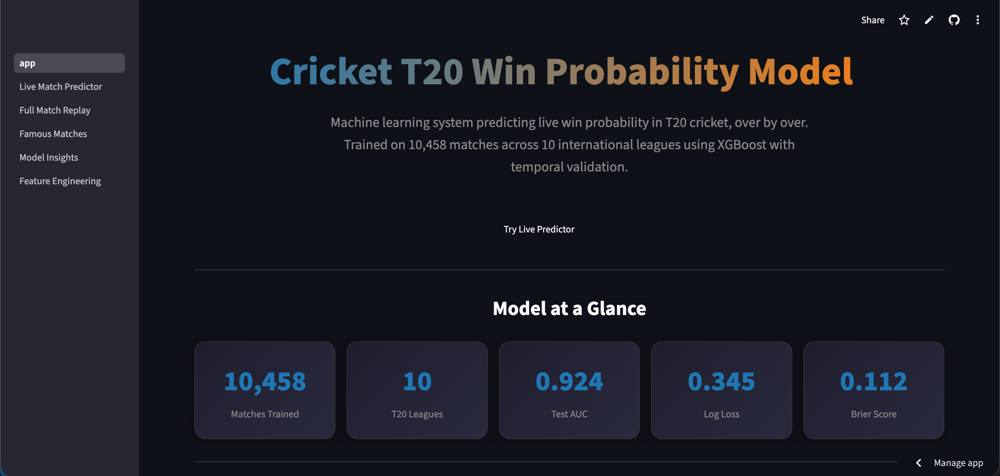
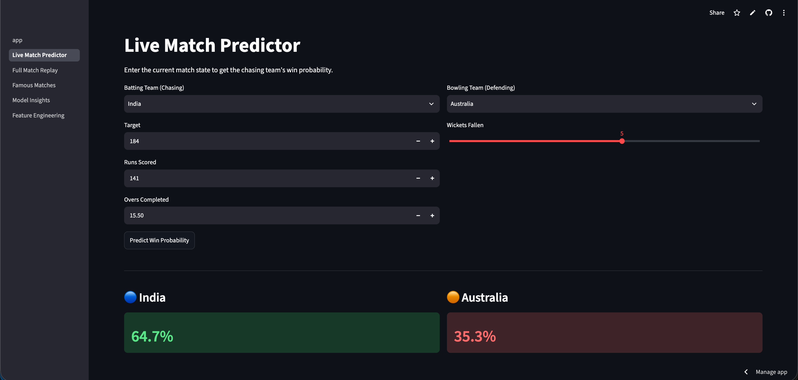
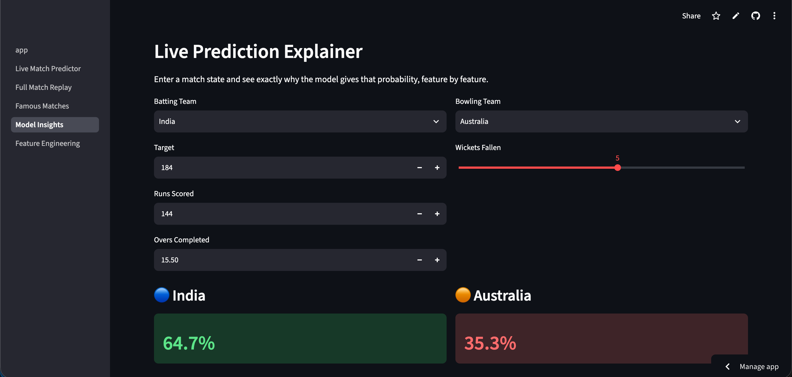
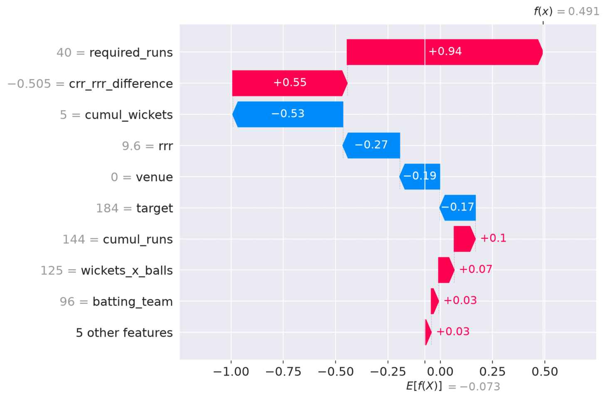
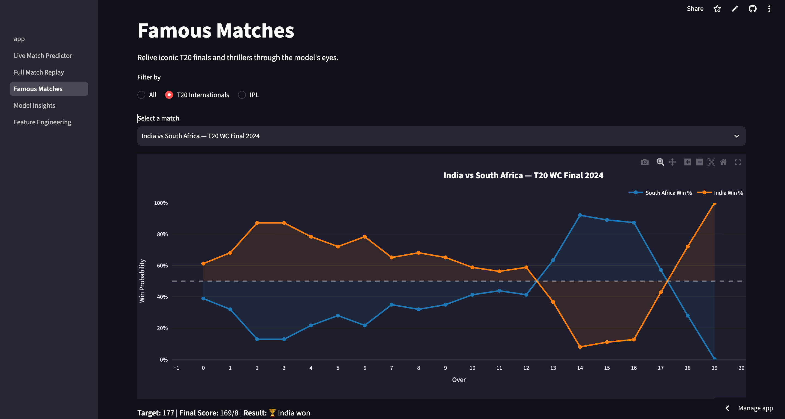
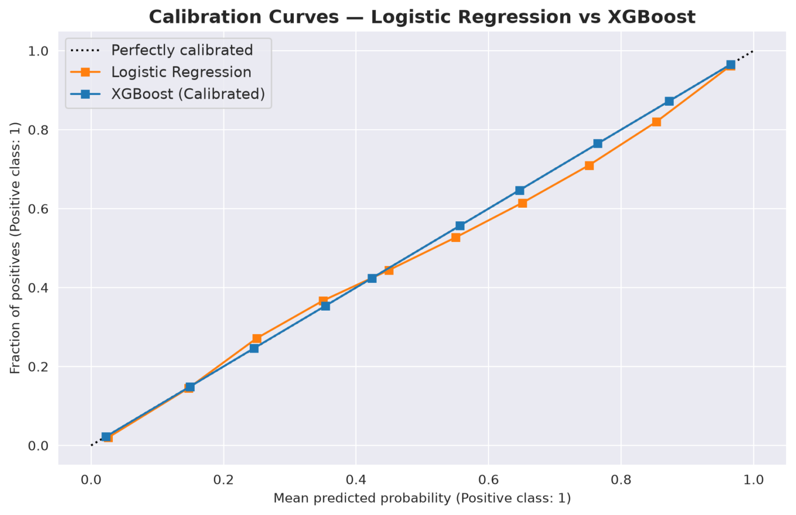

# Cricket T20 Win Probability Predictor

Predicts the win probability of the chasing team after every over of a T20 cricket match, using ball-by-ball data from 2.3 million deliveries across 10,458 professional matches. Calibrated XGBoost achieves 0.924 AUC and 0.112 Brier Score on a chronologically held-out 2025-2026 test set, validated against real match narratives including the 2024 T20 World Cup Final.

**10,458 matches** · **2.39M deliveries** · **10 T20 leagues** · **AUC 0.924** · **Brier 0.112** · **XGBoost + SHAP** · **[Live App](https://cricket-t20-win-probability.streamlit.app)**

<br>



---

## Live Demo

- **App:** https://cricket-t20-win-probability.streamlit.app
- **Notebook:** https://github.com/GranBan/granthbangard_ds_portfolio/blob/main/Cricket%20T20%20Win%20Probability%20Predictor/t20_win_probability.ipynb
- **Data Source:** [Cricsheet](https://cricsheet.org)

| Model | AUC | Log Loss | Brier Score |
|---|---|---|---|
| Logistic Regression | 0.917 | 0.360 | 0.118 |
| XGBoost | 0.923 | 0.348 | 0.113 |
| **XGBoost (Calibrated)** | **0.924** | **0.345** | **0.112** |



---


---


---

## Why This Project Exists

Most sports win-probability projects report a ranking metric (AUC, accuracy) and stop. But a win probability system's output is consumed directly as a number, "70%", so probability quality matters as much as classification correctness. This project treats calibration as a requirement to be measured and corrected, not assumed, and validates the final model against dramatic real matches before shipping it.

---

## Pipeline

```mermaid
graph LR
    A[Cricsheet JSON] --> B[Parser] --> C[Ball-by-ball df] --> D[2nd innings filter] --> E[Over-level aggregation] --> F[Feature engineering] --> G[Temporal split] --> H[Logistic Regression] --> I[XGBoost] --> J[Isotonic calibration] --> K[SHAP selection] --> L[Streamlit]
```



---

**Ingestion.** Custom parser flattens 10,458 Cricsheet match JSONs into a single 2.39M-row ball-by-ball dataframe.

**Innings filter.** Only 2nd innings (chasing team) rows are kept. First-innings win probability requires projecting a target first, a different problem, deliberately scoped out.

**Over-level aggregation.** Predictions are made after every over, not every ball. Ball-level probabilities were rejected because they introduce visually noisy, non-monotonic swings that undermine trust in a live product, even when the underlying math is valid.

**Feature engineering.** Required runs, required run rate, current run rate, and their difference (`crr_rrr_difference`, the strongest single predictor) are computed from game state. A `wickets_x_balls` interaction term captures that 8 wickets with 30 balls left is materially different from 2 wickets with 30 balls left. Rolling 3-over runs and wickets add momentum, since two teams at the same cumulative score can be in very different form.

**Temporal split.** Cricket has changed materially since 2008, scoring rates are higher, batting is more aggressive. A random split would let 2024 matches leak into training while 2010 matches sit in test. Filtered directly on `season`: train 2008-2024, test 2025-2026, with 2005-2007 dropped for insufficient T20 volume.

**Baseline before complexity.** Logistic Regression is trained first as a genuine benchmark (0.917 AUC on its own). XGBoost is justified as final model only because it beats that baseline on every metric measured.

**Calibration.** Isotonic regression fit on top of XGBoost, verified visually with calibration curves rather than assumed correct.

**SHAP for feature selection.** Not just an interpretation chart, three features showed exactly zero mean absolute SHAP value and were dropped with no performance loss, an evidence-driven decision, not intuition.

---

## Interactive Demo

**Live Match Predictor** — Enter current over, runs, wickets, target, and teams; returns an instant calibrated win probability with a live SHAP waterfall showing which features drove that specific prediction.

**Full Match Replay** — Upload any Cricsheet T20 match JSON. The app runs the identical feature pipeline used in training and plots the win probability curve over every over of that match.

**Famous Matches** — 21 pre-loaded historic T20 finals and thrillers, each with the model's win probability curve overlaid on actual match events.

**Model Insights** — Calibration curves for both models side by side, global SHAP feature importance, and a live SHAP explainer tied to user input.

**Feature Engineering** — Full pipeline documentation, including features tried and rejected, with reasoning made explicit.



---



---

## Feature Engineering

| Feature | Rationale |
|---|---|
| `crr_rrr_difference` | Strongest single predictor; captures pressure directly |
| `wickets_x_balls` | Interaction term; wickets and balls remaining aren't independent |
| `runs_in_last_3_overs`, `wickets_in_last_3_overs` | Momentum, not just cumulative totals |
| `remaining_balls`, `remaining_wickets` | **Rejected** — zero marginal SHAP value, fully absorbed by `wickets_x_balls` |
| `match_phase` | **Rejected** — zero marginal SHAP value, redundant with `over` |

---

## Evaluation

Accuracy is reported for completeness but isn't the optimization target. **Log loss and Brier score are primary**, they penalize confidently wrong predictions and directly measure whether stated confidence matches reality.

Both models are well-calibrated in the 0.5-0.8 range, with Logistic Regression tracking marginally tighter there. XGBoost is clearly better calibrated at 0.8-1.0, the range that matters most operationally since that's where a live chase sits during its most-watched, most-decided moments.

---

## Repository Structure

This repository contains the analysis notebook. The deployed Streamlit app lives in a separate repository.

**App source code:** https://github.com/GranBan/cricket-t20-win-probability

Cricket T20 Win Probability Predictor/  
  ├── t20_win_probability.ipynb  
  ├── README.md  
  ├── assets/  
    ├── screenshots/  
      ├── calibration_curves.png  
      ├── famous_matches.png  
      ├── homepage_hero_t20.png  
      ├── live_match_predictor.png  
      ├── live_prediction_explainer.png  
      └── live_prediction_SHAP_features_waterfall.png  

## Installation

```bash
pip3 install -r requirements.txt
streamlit run app.py
```

## Tech Stack

- **Language:** Python
- **ML:** scikit-learn, XGBoost
- **Explainability:** SHAP
- **Visualization:** Matplotlib, Plotly
- **Deployment:** Streamlit Community Cloud
- **Data:** Cricsheet (JSON), pandas, NumPy

---

<details>
<summary><strong>Engineering Decisions</strong></summary>

**Why over-level, not ball-level?** Ball-level probability is noisier and can look non-monotonic in a way that undermines trust, even when statistically sound.

**Why temporal split, not k-fold?** Random or k-fold splitting across seasons leaks future data into training, inflating performance in a way that wouldn't survive real deployment.

**Why XGBoost over Logistic Regression?** By measurement, not default. LR was evaluated first; XGBoost is final only because it beat it on every metric checked.

**Why isotonic over Platt scaling?** Isotonic is non-parametric and more flexible, and 142K+ training rows avoid its main failure mode of overfitting small samples.

**Why label encoding over one-hot?** One-hot across hundreds of venues/teams from 10 leagues creates a large sparse space for marginal benefit. Encoders fit on the full dataset before the split, since encoding doesn't touch the target and carries no leakage risk.

</details>

<details>
<summary><strong>Challenges</strong></summary>

**Indexing bug risk.** Filtering `df_model` on a boolean mask built from a separate `df_over` dataframe worked only because both shared identical indices at that point, a fragile pattern that would silently break on out-of-order execution. Fixed to filter on `df_model`'s own column.

**Calibration methodology.** The isotonic calibrator was fit with `cv='prefit'` directly on the test set rather than a separate validation set, making the reported calibration improvement somewhat optimistic. The underlying XGBoost model was trained on properly separated data; only the calibration evaluation carries this caveat.

**Deployment defaults.** The live predictor can't reasonably ask a casual user for an exact venue name, so venue defaults to a fixed encoded value, a real tradeoff between input friction and feature completeness.

</details>

<details>
<summary><strong>Limitations</strong></summary>

- Calibration was evaluated with the calibrator fit on the test set itself; a three-way split would remove this optimism bias
- The model degrades on extreme last-ball scenarios (15+ runs off one ball), a genuine edge case with sparse historical precedent
- Venue isn't meaningfully used at inference time in the deployed app, since exact venue input isn't practical for a casual user

</details>

<details>
<summary><strong>Future Improvements</strong></summary>

- Three-way train/validation/test split to remove the calibration optimism bias
- Ablation study isolating the AUC/Brier contribution of calibration and rolling-window features independently
- First-innings score projection, chained into the existing model for a full-match probability system
- Systematic error analysis surfacing whether misses cluster by competition, venue, or match phase

</details>

---

## Results

10,458 matches, 2.39M ball-level records, one calibrated XGBoost model. AUC 0.924, Log Loss 0.345, Brier Score 0.112 on a chronologically held-out 2025-2026 season. Three features removed on SHAP evidence with no performance cost. Validated qualitatively against 21 real matches before shipping as a 5-page live Streamlit application.
