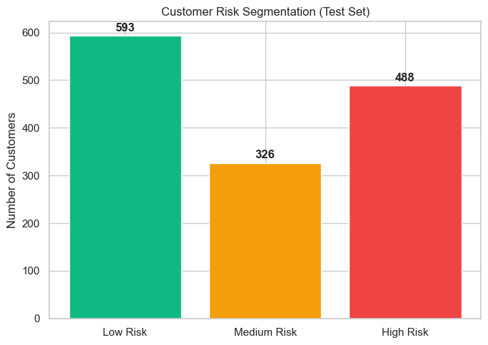
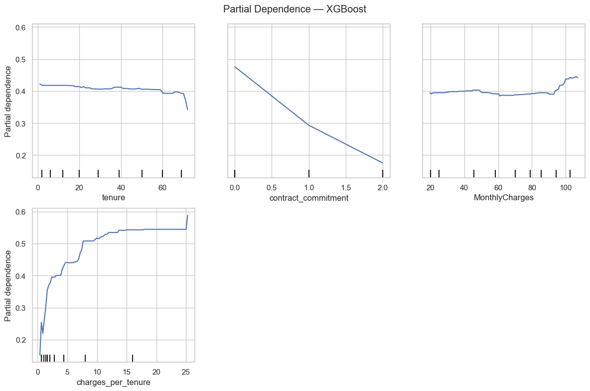

# Customer Churn & Retention Intelligence
 &nbsp;&nbsp;  &nbsp;&nbsp; 

**Notebook:** [View](https://github.com/GranBan/granthbangard_ds_portfolio/blob/main/Customer%20Churn%20and%20Retention%20Intelligence/Customer%20Churn%20%26%20Retention.ipynb)

Predicts customer churn for a subscription telecom business and converts that prediction into a cost-aware retention plan. Four model families (Logistic Regression, Random Forest, XGBoost, SVM) are trained, cross-validated, and compared; Logistic Regression is deployed for its interpretability, with XGBoost retained as an independent check that the simpler model isn't missing non-linear signal.

 &nbsp;&nbsp;&nbsp;  &nbsp;&nbsp;&nbsp;  &nbsp;&nbsp;&nbsp;  &nbsp;&nbsp;&nbsp; 

## Contents
- [Why This Project Exists](#why-this-project-exists)
- [Pipeline](#pipeline)
- [Results](#results)
- [Feature Engineering](#feature-engineering)
- [Decision Layer](#decision-layer)
- [Business Impact](#business-impact)
- [Repository Structure](#repository-structure)
- [Tech Stack](#tech-stack)
- [Engineering Decisions](#engineering-decisions)
- [Limitations](#limitations)
- [Future Improvements](#future-improvements)

---

## Why This Project Exists

Predicting churn is only half the problem — a model that outputs "72% likely to churn" is only useful if a business knows what to do with that number, and can defend the number itself. This project treats model selection as a genuine trade-off (accuracy vs. interpretability, not just picking the top ROC-AUC), validates that trade-off independently rather than asserting it, and translates every technical choice — the threshold, the risk tiers, the odds ratios — into a decision a retention team could actually act on.

---

## Pipeline


**Cleaning.** `TotalCharges` coerced to numeric, incomplete records dropped, non-predictive customer ID removed.

**Feature engineering.** Four business-hypothesis-driven features: lifecycle-stage tenure groups, an ordinal contract-commitment score (switching friction), an aggregated service engagement score, and a price-intensity ratio (`MonthlyCharges / tenure`) that flags customers paying a lot relative to how long they've stayed.

**Four models, deliberately different paradigms.** Logistic Regression (linear), Random Forest (bagged trees), XGBoost (boosted trees), and SVM (margin-based, RBF kernel) — chosen to compare fundamentally different learning approaches rather than four variations on the same idea.

**Hyperparameter tuning.** All four models tuned via `RandomizedSearchCV` with 5-fold stratified cross-validation, optimizing ROC-AUC. Tuning meaningfully changed the picture: an untuned Random Forest looked competitive at baseline largely due to overfitting, and after regularization all four models converged to a tight 0.8395–0.8444 test ROC-AUC band.

**Threshold optimization.** Rather than eyeballing 0.3/0.4/0.5, the deployment threshold is derived by maximizing F2 score (recall weighted 2x precision) directly from the precision-recall curve — reflecting that missing an at-risk customer costs more than an unnecessary retention offer.

**Calibration check.** Since deployment decisions rely on the actual probability values (not just rank-ordering), a calibration curve and Brier score confirm whether predicted probabilities correspond to real-world churn frequencies.

**Error analysis.** False positives and false negatives are profiled separately rather than just counted, surfacing a genuine model blind spot.

**PDP validation.** Since Logistic Regression assumes linear feature effects, partial dependence plots from the tuned XGBoost model are used to independently check whether that linear assumption is actually safe — evidence for the interpretability trade-off, not just an assertion of it.

---

## Results

| Model | CV ROC-AUC | Test ROC-AUC | Recall (Churn) | Precision (Churn) |
|---|---|---|---|---|
| **Logistic Regression** | 0.8496 ± 0.0109 | 0.8427 | 0.92 | 0.42 |
| Random Forest | 0.8454 ± 0.0110 | 0.8400 | 0.87 | 0.49 |
| XGBoost | 0.8489 ± 0.0106 | **0.8444** | 0.90 | 0.46 |
| SVM | 0.8482 ± 0.0113 | 0.8395 | 0.90 | 0.44 |

<p align="center">
  
</p>

XGBoost edges out Logistic Regression by roughly 0.002 ROC-AUC after tuning — a gap small enough that interpretability, not raw accuracy, drove the final model choice. Logistic Regression was deployed at an F2-optimized threshold of **0.298**, catching **92% of actual churners** (345 of 374 in the test set) while keeping the model's decisions fully explainable through coefficients and odds ratios.

---

## Feature Engineering

| Feature | Rationale |
|---|---|
| `tenure_group_encoded` | Captures early-vs-late lifecycle churn behavior that raw tenure alone smooths over |
| `contract_commitment` | Ordinal encoding of switching friction (month-to-month → two-year) |
| `engagement_score` | Aggregates six value-added services into a single stickiness signal |
| `charges_per_tenure` | Flags customers paying a lot relative to how long they've stayed — new, price-sensitive customers read differently from long-tenured ones at the same monthly rate |

---

## Decision Layer

Predicted probabilities are converted into three risk tiers, each mapped to a concrete retention action and cost:

| Risk Segment | Action | Est. Cost/Customer | Test Set Count |
|---|---|---|---|
| High Risk | Personalized retention call + discount offer | $40 | 488 |
| Medium Risk | Automated engagement email + service reminder | $5 | 326 |
| Low Risk | No action | $0 | 593 |

<p align="center">
  
</p>

Targeted spend across the top two tiers totals **$21,150** — versus **$56,280** for a blanket $40 offer to every customer, a **2.7x cost reduction** with no loss in coverage of actual churners.

---


---

## Business Impact

Odds ratios convert the model's coefficients into statements a retention team can act on directly — e.g., customers on fiber-optic internet or paying by electronic check carry meaningfully higher churn odds, while longer contract commitment and tech support adoption are protective. Error analysis further identified a specific blind spot: long-tenured, high-commitment customers who churn unexpectedly, without the usual early-tenure warning signs — flagged explicitly as a known limitation rather than something the current feature set can resolve.

---

## Repository Structure

```
Customer Churn and Retention Intelligence/
├── Customer Churn & Retention.ipynb
├── README.md
└── Plots/
    ├── ROC_curve_plot.png
    ├── pdp_plot.png
    └── risk_segmentation.png
```

## Tech Stack

- **Language:** Python
- **ML:** scikit-learn, XGBoost
- **Visualization:** Matplotlib, seaborn
- **Data:** pandas, NumPy

---

<details>
<summary><strong>Engineering Decisions</strong></summary>

**Why four model families, not two?** Logistic Regression and Random Forest alone only compare linear vs. bagged trees. Adding XGBoost (boosting) and SVM (margin-based, kernel) tests genuinely different learning paradigms rather than just two flavors of the same idea — and gives a real answer to "why not just use XGBoost" beyond a small ROC-AUC gap.

**Why Logistic Regression over XGBoost despite XGBoost's higher ROC-AUC?** The gap after tuning is ~0.002 ROC-AUC — negligible. Logistic Regression's coefficients and odds ratios give a retention team a transparent, per-customer explanation for every prediction; XGBoost would need SHAP on top to reach comparable transparency for a marginal accuracy gain.

**Why validate with XGBoost's partial dependence plots instead of just trusting Logistic Regression's linearity assumption?** Logistic Regression assumes each feature contributes linearly to churn log-odds. Rather than asserting that assumption is safe, XGBoost's PDPs (which can capture non-linear effects) are used as an independent check — the two models agree closely, which is evidence, not just an assumption, that the simpler model isn't sacrificing meaningful signal.

<p align="center">
  
</p>

**Why F2-optimized threshold over a round number?** A missed churner costs more than an unnecessary retention offer. Deriving the threshold directly from the precision-recall curve gives a reproducible, defensible number instead of an eyeballed 0.4 or 0.5.

</details>

<details>
<summary><strong>Challenges</strong></summary>

**Silent feature-encoding bug.** An early version of the encoding pipeline filtered to numeric columns *before* identifying categorical columns to one-hot encode — meaning `pd.get_dummies` ran on an already-empty categorical column list and silently did nothing. Every raw categorical feature discussed in the EDA (`InternetService`, `PaymentMethod`, `TechSupport`, etc.) was being dropped from the model entirely, despite the notebook's own documentation claiming they were encoded. Caught by cross-checking the encoding code against its own summary text, fixed by reordering the column-type selection, and every downstream model, threshold, and metric was re-run against the corrected feature set.

**Threshold sensitivity to feature set.** Fixing the encoding bug changed the F2-optimal threshold meaningfully (0.457 → 0.298), since the added categorical signal shifted where Logistic Regression's probability estimates separated the two classes. This required re-deriving every threshold-dependent section (error analysis, risk segmentation, business interpretation) rather than treating the fix as a one-line patch.

</details>

<details>
<summary><strong>Limitations</strong></summary>

- The deployed model's main blind spot is long-tenured, high-commitment customers who churn unexpectedly — these customers don't fit the "new, price-sensitive, low-commitment" risk pattern the model has learned, and are likely driven by factors (service issues, competitor offers, life changes) not present in the current feature set
- Calibration shows Logistic Regression slightly overestimates churn probability at higher risk levels — probabilities are better treated as relative risk rankings than exact likelihoods
- Retention action costs ($40 / $5 / $0) are illustrative estimates, not sourced from actual telecom retention program data

</details>

<details>
<summary><strong>Future Improvements</strong></summary>

- SHAP explanations for the tuned XGBoost model, extending its existing role as a validation reference
- Cost-sensitive modeling incorporating customer lifetime value alongside retention cost
- A/B testing to validate that model-driven retention offers actually reduce churn in practice
- Model monitoring for data and prediction drift post-deployment, with defined retraining triggers
- Deeper investigation into the long-tenure churn blind spot using data sources not currently available (support tickets, competitor pricing, service outage history)

</details>
