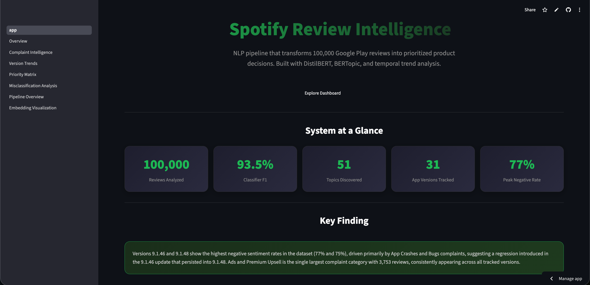
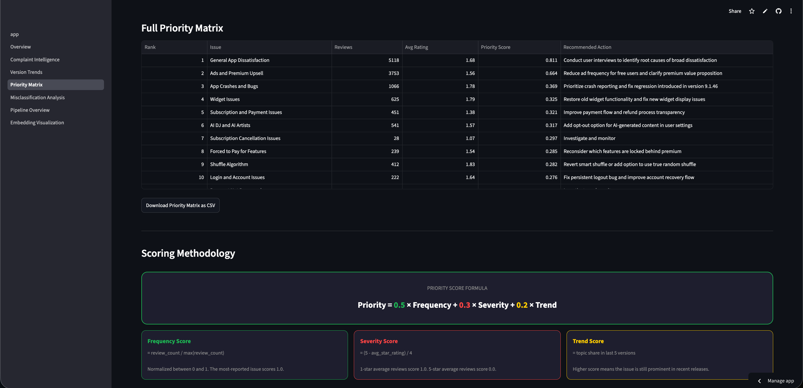
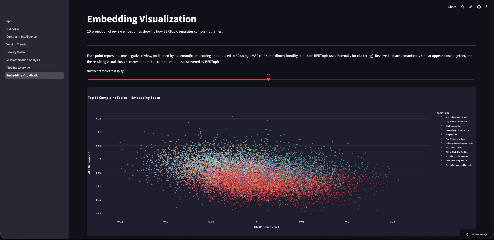
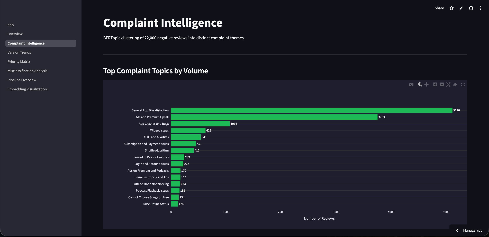
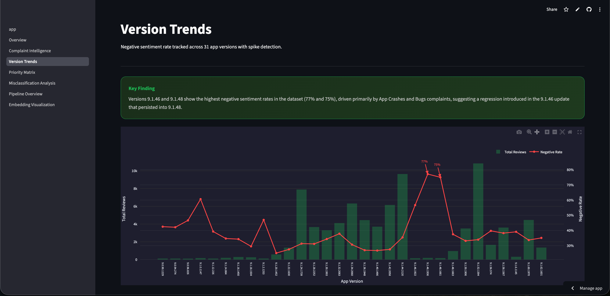

# Spotify NLP App Review Intelligence System


Transforms 100,000 raw Google Play reviews into a prioritized product decision system for Spotify. Fine-tuned DistilBERT classifies sentiment from text (93.5% macro F1), BERTopic discovers 51 complaint themes, and a custom priority matrix scores each theme by frequency, severity, and recent trend into a ranked, actionable fix list.

**100,000 reviews** · **93.5% Macro F1** · **51 complaint topics** · **DistilBERT + BERTopic** · **[Live App](https://spotify-review-intelligence.streamlit.app)**

## Contents

- [Live Demo](#live-demo)
- [Why This Project Exists](#why-this-project-exists)
- [Pipeline](#pipeline)
- [Interactive Demo](#interactive-demo)
- [Evaluation](#evaluation)
- [Repository Structure](#repository-structure)
- [Installation](#installation)
- [Tech Stack](#tech-stack)
- [Engineering Decisions](#engineering-decisions)
- [Challenges](#challenges)
- [Limitations](#limitations)
- [Future Improvements](#future-improvements)

---



---

## Live Demo

- **App:** https://spotify-review-intelligence.streamlit.app
> [!NOTE]
> The app may take 30-60 seconds to wake up on first load if it's been inactive, Streamlit Community Cloud puts unused apps to sleep. Subsequent loads are fast.
- **Notebook:** https://github.com/GranBan/granthbangard_ds_portfolio/blob/main/Spotify%20NLP%20App%20Review%20Intelligence%20System/app_review_nlp.ipynb
- **Data Source:** Google Play Store, scraped directly via `google-play-scraper`

| Metric | Value |
|---|---|
| Macro F1 | 0.935 |
| Accuracy | 0.94 |
| Average Prediction Confidence | 96.2% |

---



---



---

## Results

100,000 reviews, one fine-tuned DistilBERT classifier (93.5% macro F1), 51 BERTopic-discovered complaint themes, one real regression identified (versions 9.1.46/9.1.48), one custom priority matrix. Deployed as a 7-page live Streamlit application translating raw review text into a ranked product backlog.

---

## Why This Project Exists

Star ratings are a noisy proxy for sentiment, a 5-star review can contain clearly negative text ("great app but too many ads"), and rating-based filtering alone misses this. This project uses the review text itself as the primary signal, then goes further: rather than stopping at a sentiment label, it discovers what users are actually complaining about, tracks whether specific app releases made things worse, and turns all of it into a ranked list a product team could act on directly.

---

## Pipeline


**Ingestion.** 100,000 Spotify reviews scraped directly from Google Play, preserving app version metadata needed for temporal analysis, a static Kaggle dump wouldn't have this.

**Sentiment classification.** Star-rating-derived labels used as an initial baseline, then replaced by a fine-tuned DistilBERT model reading review text directly. Initial 3-class setup only reached 71% macro F1, limited by a small (5,565 sample), inherently ambiguous neutral class. Switching to binary (Negative/Positive) and using the full available data (56,510 balanced training reviews) raised macro F1 to 93.5%.

> [!IMPORTANT]
> Macro F1, not accuracy, is the primary metric here, it weights both classes equally despite the 66/28/6 class imbalance in the raw star-rating data.

**Full inference.** The fine-tuned model runs on all 100,000 reviews, producing text-based labels that diverge meaningfully from star-rating labels: 3,554 high-star reviews were predicted negative based on their text.

**English filtering.** Despite scraping with `lang='en'`, non-English reviews slipped through. Filtered via `langdetect` before topic modeling, since mixed-language text degrades embedding-based clustering quality.

**Topic modeling.** BERTopic with `all-MiniLM-L6-v2` sentence embeddings, chosen over bag-of-words methods like LDA because semantically similar complaints cluster together even without shared vocabulary. Applied only to predicted-negative reviews with 10+ words (22,630 after filtering). `min_topic_size=20` was chosen after testing `50` (only 5 topics, too coarse) against `20` (51 topics, appropriately granular).

**Manual topic labeling.** BERTopic's auto-generated labels aren't usable in a dashboard. Each of the 51 topics was manually reviewed against its keywords and representative documents, then assigned a clean business label or marked as noise.

**Temporal trend analysis.** Negative sentiment rate tracked across every app version with 100+ reviews, surfacing a real regression: versions 9.1.46 and 9.1.48 show 77% and 75% negative rates, both dominated by crash complaints.

**Priority matrix.** Frequency (50%), severity (30%, average star rating), and recent trend (20%, share of the 5 most recent versions) combine into a single score per topic, converting NLP output directly into a ranked engineering backlog with a recommended action per issue.

---

## Interactive Demo

**Overview** - Sentiment distribution, review volume trends, and dataset summary statistics.

**Complaint Intelligence** - BERTopic clusters with representative reviews and keyword search.

**Version Trends** - Negative sentiment rate tracked across app versions with spike detection.

**Priority Matrix** - Ranked, actionable fix list with transparent scoring methodology.

**Misclassification Analysis** - Where model predictions disagree with star ratings, and why.

**Embedding Visualization** - 2D UMAP projection showing how BERTopic separates complaint themes.

---



---



---

## Evaluation

| | Precision | Recall | F1 |
|---|---|---|---|
| Negative | 0.93 | 0.94 | 0.94 |
| Positive | 0.94 | 0.93 | 0.94 |

Macro F1 (not accuracy) is the headline metric, it weights both classes equally regardless of the 66/28/6 positive/negative/neutral imbalance in the raw data.

Average prediction confidence is 96.2%, with 90.5% of predictions above 90% confidence and only 1% below 60%, the model is decisive rather than hedging.

---

## Repository Structure

This repository contains the analysis notebook. The deployed Streamlit app lives in a separate repository.

**App source code:** https://github.com/GranBan/spotify-review-intelligence

```
Spotify NLP App Review Intelligence System/
├── app_review_nlp.ipynb
├── README.md
├── assets/
  ├── screenshots/
    ├── complaint_intelligence.png
    ├── embedding_viz.png
    ├── homepage_hero_spotify.png
    ├── priority_matrix.png
    ├── version_trends.png
```

## Installation

This repository contains the model development notebook. The deployed Streamlit application is maintained in a separate repository:

**NLP:** https://github.com/GranBan/spotify-review-intelligence

## Tech Stack

- **Language:** Python
- **NLP/ML:** transformers, DistilBERT, BERTopic, sentence-transformers, scikit-learn
- **Visualization:** Plotly
- **Deployment:** Streamlit Community Cloud
- **Data:** google-play-scraper, pandas, NumPy

---

<details>
<summary><strong>Engineering Decisions</strong></summary>

**Why DistilBERT over VADER or rule-based sentiment?** Rule-based tools fail on domain-specific and sarcastic language ("the shuffle is broken again" reads neutral to VADER). Fine-tuning adapts the model to app-review-specific language.

**Why BERTopic over LDA?** LDA's bag-of-words representation misses semantic meaning; embedding-based clustering captures context, which matters for short, colloquial review text with high vocabulary variance.

**Why manual topic labeling over automated?** Auto-generated keyword labels aren't business-readable and don't distinguish actionable clusters from noise. Manual review converts algorithmic output into language a product team can act on.

**Why a 10-word minimum for topic modeling?** 33% of all reviews are 5 words or fewer. These produce generic embeddings that dilute cluster quality; the threshold retains 19,406+ usable negative reviews while removing noise.

</details>

<details>
<summary><strong>Challenges</strong></summary>

**Non-English contamination.** Despite `lang='en'` in the scraper call, ~5% of reviews passed through in other languages, discovered only after an initial BERTopic run produced entire clusters of Hindi and Arabic text mixed into the English topic space. Fixed with a `langdetect` pass before clustering.

**Deployment memory limits.** Loading the full 100K-row, multi-column dataset directly in Streamlit caused repeated segmentation faults on Streamlit Community Cloud's free tier. Fixed by splitting into purpose-specific lightweight CSVs rather than loading full data on every page.

**BERTopic granularity tuning.** `min_topic_size=50` produced only 5 overly broad topics; `20` produced 51 usable ones. This required an actual retraining run on Colab to compare, not a parameter guess.

</details>

<details>
<summary><strong>Limitations</strong></summary>

- 35% of negative reviews fall into a noise cluster and aren't represented in the priority matrix
- 16.4% of reviews lack app version metadata and are excluded from temporal analysis
- In-app review search operates on an 820-review sample, not the full corpus, for deployment memory efficiency

</details>

<details>
<summary><strong>Future Improvements</strong></summary>

- Topic coherence and diversity metrics to formally validate BERTopic cluster quality
- Automated weekly re-scraping and inference pipeline to keep sentiment tracking current
- Aspect-based sentiment analysis to separate multiple complaints within a single review
- Cold-start handling for detecting entirely new complaint categories as they emerge

</details>
